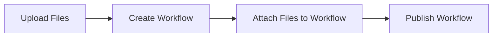

# NovaWrite API Documentation

## Base URL
```
https://naqashthaheem.com/api
```

## Authentication
All protected endpoints require a Bearer token in the Authorization header:
```
Authorization: Bearer YOUR_JWT_TOKEN
```

---

## 📁 File Management API

### Upload File
**POST** `/files`

Upload a new file to the system.

**Headers:**
```
Content-Type: multipart/form-data
Authorization: Bearer YOUR_JWT_TOKEN
```

**Body (multipart/form-data):**
```
file: [FILE] (required) - The file to upload
is_public: boolean (optional) - Whether the file is public (default: true)
```

**Supported File Types:**
- Images: JPG, JPEG, PNG, GIF, WebP, SVG
- Documents: PDF, DOC, DOCX, TXT
- Archives: ZIP
- Data: JSON

**Max File Size:** 10MB

**Response:**
```json
{
  "message": "File uploaded successfully.",
  "file": {
    "id": 1,
    "name": "example_image",
    "original_name": "example_image.jpg",
    "path": "uploads/1234567890_example_image.jpg",
    "mime_type": "image/jpeg",
    "size": 1024000,
    "is_public": true,
    "user_id": 1,
    "created_at": "2025-01-05T10:30:00.000000Z",
    "updated_at": "2025-01-05T10:30:00.000000Z",
    "user": {
      "id": 1,
      "name": "John Doe",
      "email": "john@example.com"
    }
  }
}
```

### Get All Files
**GET** `/files`

Get all files uploaded by the authenticated user.

**Headers:**
```
Authorization: Bearer YOUR_JWT_TOKEN
```

**Response:**
```json
[
  {
    "id": 1,
    "name": "example_image",
    "original_name": "example_image.jpg",
    "path": "uploads/1234567890_example_image.jpg",
    "mime_type": "image/jpeg",
    "size": 1024000,
    "is_public": true,
    "user_id": 1,
    "created_at": "2025-01-05T10:30:00.000000Z",
    "updated_at": "2025-01-05T10:30:00.000000Z",
    "user": {
      "id": 1,
      "name": "John Doe",
      "email": "john@example.com"
    }
  }
]
```

### Get Files by Type
**GET** `/files/type/{type}`

Get files filtered by MIME type.

**Parameters:**
- `type` (string) - MIME type prefix (e.g., "image", "application", "text")

**Headers:**
```
Authorization: Bearer YOUR_JWT_TOKEN
```

**Example:**
```
GET /files/type/image
```

**Response:**
```json
[
  {
    "id": 1,
    "name": "example_image",
    "original_name": "example_image.jpg",
    "path": "uploads/1234567890_example_image.jpg",
    "mime_type": "image/jpeg",
    "size": 1024000,
    "is_public": true,
    "user_id": 1,
    "created_at": "2025-01-05T10:30:00.000000Z",
    "updated_at": "2025-01-05T10:30:00.000000Z"
  }
]
```

### Download File
**GET** `/files/{id}/download`

Download a file by ID.

**Parameters:**
- `id` (integer) - File ID

**Response:** File download

---

## 📝 Posts API

### Create Post
**POST** `/posts`

Create a new blog post.

**Headers:**
```
Content-Type: application/json
Authorization: Bearer YOUR_JWT_TOKEN
```

**Body:**
```json
{
  "title": "My Blog Post",
  "slug": "my-blog-post",
  "excerpt": "Short description of the post",
  "content": "Full blog post content in markdown",
  "featured_image": "https://naqashthaheem.com/storage/uploads/1234567890_image.jpg",
  "meta_title": "SEO Title",
  "meta_description": "SEO Description",
  "status": "published",
  "category_id": 1
}
```

**Response:**
```json
{
  "message": "Post created successfully",
  "post": {
    "id": 1,
    "title": "My Blog Post",
    "slug": "my-blog-post",
    "excerpt": "Short description of the post",
    "content": "Full blog post content in markdown",
    "featured_image": "https://naqashthaheem.com/storage/uploads/1234567890_image.jpg",
    "meta_title": "SEO Title",
    "meta_description": "SEO Description",
    "status": "published",
    "category_id": 1,
    "created_at": "2025-01-05T10:30:00.000000Z",
    "updated_at": "2025-01-05T10:30:00.000000Z"
  }
}
```

### Update Post
**PUT** `/posts/{id}`

Update an existing blog post.

**Headers:**
```
Content-Type: application/json
Authorization: Bearer YOUR_JWT_TOKEN
```

**Body:** Same as create post

### Get All Posts
**GET** `/posts`

Get all published posts (public endpoint).

**Response:**
```json
[
  {
    "id": 1,
    "title": "My Blog Post",
    "slug": "my-blog-post",
    "excerpt": "Short description of the post",
    "featured_image": "https://naqashthaheem.com/storage/uploads/1234567890_image.jpg",
    "created_at": "2025-01-05T10:30:00.000000Z"
  }
]
```

---

## ⚡ Workflows API

### Create Workflow
**POST** `/admin/workflows`

Create a new workflow (Admin only).

**Headers:**
```
Content-Type: application/json
Authorization: Bearer YOUR_JWT_TOKEN
```

**Body:**
```json
{
  "workflow_category_id": 1,
  "title": "Automated Invoice Processing",
  "summary": "Streamline invoice processing from receipt to payment",
  "description": "This workflow automates the entire invoice processing pipeline...",
  "tools": ["Python", "Pandas", "OpenCV", "Email API"],
  "benefits": ["Faster processing", "Better accuracy", "Cost savings"],
  "status": "published",
  "is_featured": true,
  "image_url": "https://naqashthaheem.com/storage/uploads/1234567890_workflow.jpg"
}
```

**Response:**
```json
{
  "message": "Workflow created successfully",
  "workflow": {
    "id": 1,
    "title": "Automated Invoice Processing",
    "slug": "automated-invoice-processing",
    "summary": "Streamline invoice processing from receipt to payment",
    "description": "This workflow automates the entire invoice processing pipeline...",
    "tools": ["Python", "Pandas", "OpenCV", "Email API"],
    "benefits": ["Faster processing", "Better accuracy", "Cost savings"],
    "status": "published",
    "is_featured": true,
    "image_url": "https://naqashthaheem.com/storage/uploads/1234567890_workflow.jpg",
    "workflow_category_id": 1,
    "created_at": "2025-01-05T10:30:00.000000Z",
    "updated_at": "2025-01-05T10:30:00.000000Z"
  }
}
```

### Update Workflow
**PUT** `/admin/workflows/{id}`

Update an existing workflow (Admin only).

**Headers:**
```
Content-Type: application/json
Authorization: Bearer YOUR_JWT_TOKEN
```

**Body:** Same as create workflow

### Get All Workflows
**GET** `/workflows`

Get all published workflows (public endpoint).

**Response:**
```json
[
  {
    "id": 1,
    "title": "Automated Invoice Processing",
    "slug": "automated-invoice-processing",
    "summary": "Streamline invoice processing from receipt to payment",
    "tools": ["Python", "Pandas", "OpenCV", "Email API"],
    "benefits": ["Faster processing", "Better accuracy", "Cost savings"],
    "is_featured": true,
    "image_url": "https://naqashthaheem.com/storage/uploads/1234567890_workflow.jpg",
    "category": {
      "id": 1,
      "name": "Data Processing"
    },
    "created_at": "2025-01-05T10:30:00.000000Z"
  }
]
```

---

## 📚 Courses API

### Create Course
**POST** `/admin/courses`

Create a new course (Admin only).

**Headers:**
```
Content-Type: application/json
Authorization: Bearer YOUR_JWT_TOKEN
```

**Body:**
```json
{
  "title": "Complete Automation Course",
  "slug": "complete-automation-course",
  "description": "Learn how to build powerful automation workflows",
  "what_you_learn": "Build automation workflows\nMaster system analysis\nCreate efficient processes",
  "image_url": "https://naqashthaheem.com/storage/uploads/1234567890_course.jpg",
  "duration_hours": 20,
  "level": "intermediate",
  "is_published": true
}
```

**Response:**
```json
{
  "message": "Course created successfully",
  "course": {
    "id": 1,
    "title": "Complete Automation Course",
    "slug": "complete-automation-course",
    "description": "Learn how to build powerful automation workflows",
    "what_you_learn": "Build automation workflows\nMaster system analysis\nCreate efficient processes",
    "image_url": "https://naqashthaheem.com/storage/uploads/1234567890_course.jpg",
    "duration_hours": 20,
    "level": "intermediate",
    "is_published": true,
    "created_at": "2025-01-05T10:30:00.000000Z",
    "updated_at": "2025-01-05T10:30:00.000000Z"
  }
}
```

### Update Course
**PUT** `/admin/courses/{id}`

Update an existing course (Admin only).

**Headers:**
```
Content-Type: application/json
Authorization: Bearer YOUR_JWT_TOKEN
```

**Body:** Same as create course

### Get All Courses
**GET** `/courses`

Get all published courses (public endpoint).

**Response:**
```json
[
  {
    "id": 1,
    "title": "Complete Automation Course",
    "slug": "complete-automation-course",
    "description": "Learn how to build powerful automation workflows",
    "image_url": "https://naqashthaheem.com/storage/uploads/1234567890_course.jpg",
    "duration_hours": 20,
    "level": "intermediate",
    "created_at": "2025-01-05T10:30:00.000000Z"
  }
]
```

### Get Course Details
**GET** `/courses/{slug}`

Get detailed course information including lessons.

**Parameters:**
- `slug` (string) - Course slug

**Response:**
```json
{
  "id": 1,
  "title": "Complete Automation Course",
  "slug": "complete-automation-course",
  "description": "Learn how to build powerful automation workflows",
  "image_url": "https://naqashthaheem.com/storage/uploads/1234567890_course.jpg",
  "what_you_learn": "Build automation workflows\nMaster system analysis\nCreate efficient processes",
  "duration_hours": 20,
  "level": "intermediate",
  "lessons": [
    {
      "id": 1,
      "title": "Introduction to Automation",
      "content": "Welcome to the course...",
      "video_url": "https://youtube.com/watch?v=example",
      "duration_minutes": 30,
      "order": 1,
      "is_free_preview": true,
      "is_locked": false,
      "is_completed": false,
      "has_test": true,
      "test_passed": false
    }
  ],
  "enrolled_users_count": 150,
  "is_enrolled": false,
  "is_logged_in": true
}
```

### Enroll in Course
**POST** `/courses/{id}/enroll`

Enroll the authenticated user in a course.

**Headers:**
```
Authorization: Bearer YOUR_JWT_TOKEN
```

**Response:**
```json
{
  "message": "Successfully enrolled in course",
  "enrollment": {
    "id": 1,
    "user_id": 1,
    "course_id": 1,
    "enrolled_at": "2025-01-05T10:30:00.000000Z"
  }
}
```

### Get My Courses
**GET** `/my-courses`

Get courses enrolled by the authenticated user.

**Headers:**
```
Authorization: Bearer YOUR_JWT_TOKEN
```

**Response:**
```json
[
  {
    "id": 1,
    "title": "Complete Automation Course",
    "slug": "complete-automation-course",
    "description": "Learn how to build powerful automation workflows",
    "image_url": "https://naqashthaheem.com/storage/uploads/1234567890_course.jpg",
    "duration_hours": 20,
    "level": "intermediate",
    "enrolled_at": "2025-01-05T10:30:00.000000Z",
    "progress": {
      "completed_lessons": 5,
      "total_lessons": 10,
      "completion_percentage": 50
    }
  }
]
```

---

## 📖 Lessons API

### Create Lesson
**POST** `/admin/courses/{courseId}/lessons`

Create a new lesson for a course (Admin only).

**Headers:**
```
Content-Type: application/json
Authorization: Bearer YOUR_JWT_TOKEN
```

**Body:**
```json
{
  "title": "Introduction to Automation",
  "content": "# Introduction to Automation\n\nWelcome to this comprehensive course on automation...",
  "video_url": "https://youtube.com/watch?v=example",
  "duration_minutes": 30,
  "is_free_preview": true
}
```

**Response:**
```json
{
  "message": "Lesson created successfully",
  "lesson": {
    "id": 1,
    "course_id": 1,
    "title": "Introduction to Automation",
    "content": "# Introduction to Automation\n\nWelcome to this comprehensive course on automation...",
    "video_url": "https://youtube.com/watch?v=example",
    "duration_minutes": 30,
    "order": 1,
    "is_free_preview": true,
    "created_at": "2025-01-05T10:30:00.000000Z",
    "updated_at": "2025-01-05T10:30:00.000000Z"
  }
}
```

### Update Lesson
**PUT** `/admin/courses/{courseId}/lessons/{id}`

Update an existing lesson (Admin only).

**Headers:**
```
Content-Type: application/json
Authorization: Bearer YOUR_JWT_TOKEN
```

**Body:** Same as create lesson

### Get Course Lessons
**GET** `/admin/courses/{courseId}/lessons`

Get all lessons for a specific course (Admin only).

**Headers:**
```
Authorization: Bearer YOUR_JWT_TOKEN
```

**Response:**
```json
[
  {
    "id": 1,
    "course_id": 1,
    "title": "Introduction to Automation",
    "content": "# Introduction to Automation\n\nWelcome to this comprehensive course on automation...",
    "video_url": "https://youtube.com/watch?v=example",
    "duration_minutes": 30,
    "order": 1,
    "is_free_preview": true,
    "created_at": "2025-01-05T10:30:00.000000Z",
    "updated_at": "2025-01-05T10:30:00.000000Z",
    "files": [
      {
        "id": 1,
        "file_path": "uploads/lesson1-resources.pdf",
        "description": "Course resources and materials"
      }
    ],
    "tests": [
      {
        "id": 1,
        "title": "Introduction Quiz",
        "description": "Test your understanding of the introduction",
        "questions": [
          {
            "id": 1,
            "question": "What is automation?",
            "options": {
              "A": "Manual work",
              "B": "Using technology to perform tasks automatically",
              "C": "Writing code",
              "D": "Data analysis"
            },
            "correct_answer": "B"
          }
        ],
        "passing_score": 70,
        "time_limit_minutes": 15,
        "is_active": true
      }
    ]
  }
]
```

### Delete Lesson
**DELETE** `/admin/courses/{courseId}/lessons/{id}`

Delete a lesson (Admin only).

**Headers:**
```
Authorization: Bearer YOUR_JWT_TOKEN
```

**Response:**
```json
{
  "message": "Lesson deleted successfully"
}
```

---

## 🧠 Quiz/Test API

### Create Lesson Test
**POST** `/admin/lessons/{lessonId}/tests`

Create a quiz/test for a lesson (Admin only).

**Headers:**
```
Content-Type: application/json
Authorization: Bearer YOUR_JWT_TOKEN
```

**Body:**
```json
{
  "title": "Introduction Quiz",
  "description": "Test your understanding of the introduction lesson",
  "questions": [
    {
      "id": 1,
      "question": "What is automation?",
      "options": {
        "A": "Manual work",
        "B": "Using technology to perform tasks automatically",
        "C": "Writing code",
        "D": "Data analysis"
      },
      "correct_answer": "B"
    },
    {
      "id": 2,
      "question": "Which of the following is NOT a benefit of automation?",
      "options": {
        "A": "Increased efficiency",
        "B": "Reduced errors",
        "C": "Higher costs",
        "D": "Time savings"
      },
      "correct_answer": "C"
    }
  ],
  "passing_score": 70,
  "time_limit_minutes": 15,
  "is_active": true,
  "order": 1
}
```

**Response:**
```json
{
  "message": "Test created successfully",
  "test": {
    "id": 1,
    "lesson_id": 1,
    "title": "Introduction Quiz",
    "description": "Test your understanding of the introduction lesson",
    "questions": [
      {
        "id": 1,
        "question": "What is automation?",
        "options": {
          "A": "Manual work",
          "B": "Using technology to perform tasks automatically",
          "C": "Writing code",
          "D": "Data analysis"
        },
        "correct_answer": "B"
      }
    ],
    "passing_score": 70,
    "time_limit_minutes": 15,
    "is_active": true,
    "order": 1,
    "created_at": "2025-01-05T10:30:00.000000Z",
    "updated_at": "2025-01-05T10:30:00.000000Z"
  }
}
```

### Update Lesson Test
**PUT** `/admin/lessons/{lessonId}/tests/{id}`

Update an existing test (Admin only).

**Headers:**
```
Content-Type: application/json
Authorization: Bearer YOUR_JWT_TOKEN
```

**Body:** Same as create test

### Get Lesson Test
**GET** `/lessons/{lessonId}/test`

Get the active test for a lesson (Authenticated users only).

**Headers:**
```
Authorization: Bearer YOUR_JWT_TOKEN
```

**Response:**
```json
{
  "test": {
    "id": 1,
    "lesson_id": 1,
    "title": "Introduction Quiz",
    "description": "Test your understanding of the introduction lesson",
    "questions": [
      {
        "id": 1,
        "question": "What is automation?",
        "options": {
          "A": "Manual work",
          "B": "Using technology to perform tasks automatically",
          "C": "Writing code",
          "D": "Data analysis"
        },
        "correct_answer": "B"
      }
    ],
    "passing_score": 70,
    "time_limit_minutes": 15,
    "is_active": true
  },
  "has_attempted": false,
  "has_passed": false
}
```

### Start Test
**POST** `/lessons/{lessonId}/test/start`

Start a test attempt (Authenticated users only).

**Headers:**
```
Authorization: Bearer YOUR_JWT_TOKEN
```

**Response:**
```json
{
  "message": "Test started",
  "attempt": {
    "id": 1,
    "user_id": 1,
    "lesson_test_id": 1,
    "started_at": "2025-01-05T10:30:00.000000Z",
    "answers": [],
    "score": null,
    "passed": false,
    "completed_at": null
  },
  "test": {
    "id": 1,
    "title": "Introduction Quiz",
    "description": "Test your understanding of the introduction lesson",
    "questions": [
      {
        "id": 1,
        "question": "What is automation?",
        "options": {
          "A": "Manual work",
          "B": "Using technology to perform tasks automatically",
          "C": "Writing code",
          "D": "Data analysis"
        }
      }
    ],
    "passing_score": 70,
    "time_limit_minutes": 15
  }
}
```

### Submit Test
**POST** `/lessons/{lessonId}/test/submit`

Submit test answers (Authenticated users only).

**Headers:**
```
Content-Type: application/json
Authorization: Bearer YOUR_JWT_TOKEN
```

**Body:**
```json
{
  "attempt_id": 1,
  "answers": ["B", "C"],
  "time_spent_minutes": 12
}
```

**Response:**
```json
{
  "message": "Test passed!",
  "attempt": {
    "id": 1,
    "user_id": 1,
    "lesson_test_id": 1,
    "answers": ["B", "C"],
    "score": 85,
    "passed": true,
    "started_at": "2025-01-05T10:30:00.000000Z",
    "completed_at": "2025-01-05T10:42:00.000000Z",
    "time_taken_minutes": 12
  },
  "score": 85,
  "passed": true,
  "lesson_completed": true
}
```

### Get Test Results
**GET** `/lessons/{lessonId}/test/results`

Get test results for a lesson (Authenticated users only).

**Headers:**
```
Authorization: Bearer YOUR_JWT_TOKEN
```

**Response:**
```json
{
  "test": {
    "id": 1,
    "title": "Introduction Quiz",
    "description": "Test your understanding of the introduction lesson",
    "passing_score": 70,
    "time_limit_minutes": 15
  },
  "latest_attempt": {
    "id": 1,
    "user_id": 1,
    "lesson_test_id": 1,
    "answers": ["B", "C"],
    "score": 85,
    "passed": true,
    "started_at": "2025-01-05T10:30:00.000000Z",
    "completed_at": "2025-01-05T10:42:00.000000Z",
    "time_taken_minutes": 12
  }
}
```

---

## 📈 Lesson Progress API

### Mark Lesson Complete
**POST** `/lessons/{lessonId}/complete`

Mark a lesson as completed (Authenticated users only).

**Headers:**
```
Content-Type: application/json
Authorization: Bearer YOUR_JWT_TOKEN
```

**Body:**
```json
{
  "time_spent_minutes": 30,
  "progress_data": {
    "video_watched": true,
    "notes_taken": true,
    "resources_downloaded": ["resource1.pdf", "resource2.docx"]
  }
}
```

**Response:**
```json
{
  "message": "Lesson marked as completed",
  "progress": {
    "id": 1,
    "user_id": 1,
    "lesson_id": 1,
    "is_completed": true,
    "completed_at": "2025-01-05T10:30:00.000000Z",
    "time_spent_minutes": 30,
    "progress_data": {
      "video_watched": true,
      "notes_taken": true,
      "resources_downloaded": ["resource1.pdf", "resource2.docx"]
    }
  }
}
```

### Get Lesson Progress
**GET** `/lessons/{lessonId}/progress`

Get progress for a specific lesson (Authenticated users only).

**Headers:**
```
Authorization: Bearer YOUR_JWT_TOKEN
```

**Response:**
```json
{
  "id": 1,
  "user_id": 1,
  "lesson_id": 1,
  "is_completed": true,
  "completed_at": "2025-01-05T10:30:00.000000Z",
  "time_spent_minutes": 30,
  "progress_data": {
    "video_watched": true,
    "notes_taken": true,
    "resources_downloaded": ["resource1.pdf", "resource2.docx"]
  }
}
```

### Get Course Progress
**GET** `/courses/{courseId}/progress`

Get progress for all lessons in a course (Authenticated users only).

**Headers:**
```
Authorization: Bearer YOUR_JWT_TOKEN
```

**Response:**
```json
{
  "1": {
    "id": 1,
    "user_id": 1,
    "lesson_id": 1,
    "is_completed": true,
    "completed_at": "2025-01-05T10:30:00.000000Z",
    "time_spent_minutes": 30
  },
  "2": {
    "id": 2,
    "user_id": 1,
    "lesson_id": 2,
    "is_completed": false,
    "completed_at": null,
    "time_spent_minutes": 0
  }
}
```

### Reset Lesson Progress
**DELETE** `/lessons/{lessonId}/progress`

Reset progress for a specific lesson (Authenticated users only).

**Headers:**
```
Authorization: Bearer YOUR_JWT_TOKEN
```

**Response:**
```json
{
  "message": "Lesson progress reset"
}
```

---

## 🔐 Authentication API

### Register User
**POST** `/auth/register`

Register a new user account.

**Headers:**
```
Content-Type: application/json
```

**Body:**
```json
{
  "name": "John Doe",
  "email": "john@example.com",
  "password": "password123",
  "password_confirmation": "password123"
}
```

**Response:**
```json
{
  "message": "User registered successfully",
  "user": {
    "id": 1,
    "name": "John Doe",
    "email": "john@example.com",
    "role": "user",
    "created_at": "2025-01-05T10:30:00.000000Z"
  },
  "token": "eyJ0eXAiOiJKV1QiLCJhbGciOiJIUzI1NiJ9..."
}
```

### Login User
**POST** `/auth/login`

Login with email and password.

**Headers:**
```
Content-Type: application/json
```

**Body:**
```json
{
  "email": "john@example.com",
  "password": "password123"
}
```

**Response:**
```json
{
  "message": "Login successful",
  "user": {
    "id": 1,
    "name": "John Doe",
    "email": "john@example.com",
    "role": "user"
  },
  "token": "eyJ0eXAiOiJKV1QiLCJhbGciOiJIUzI1NiJ9..."
}
```

### Get Current User
**GET** `/auth/me`

Get current authenticated user information.

**Headers:**
```
Authorization: Bearer YOUR_JWT_TOKEN
```

**Response:**
```json
{
  "id": 1,
  "name": "John Doe",
  "email": "john@example.com",
  "role": "user",
  "created_at": "2025-01-05T10:30:00.000000Z",
  "updated_at": "2025-01-05T10:30:00.000000Z"
}
```

---

## 📊 Error Responses

### 400 Bad Request
```json
{
  "message": "Validation failed",
  "errors": {
    "title": ["The title field is required."],
    "email": ["The email must be a valid email address."]
  }
}
```

### 401 Unauthorized
```json
{
  "message": "Unauthenticated"
}
```

### 403 Forbidden
```json
{
  "message": "Access denied. Admin privileges required."
}
```

### 404 Not Found
```json
{
  "message": "Resource not found"
}
```

### 422 Unprocessable Entity
```json
{
  "message": "The given data was invalid.",
  "errors": {
    "file": ["The file must be a file of type: jpg, jpeg, png, gif, webp, svg."]
  }
}
```

### 500 Internal Server Error
```json
{
  "message": "Server Error"
}
```

---

## 🔧 Image Upload Examples

### Using cURL

#### Upload Image for Post
```bash
curl -X POST https://naqashthaheem.com/api/files \
  -H "Authorization: Bearer YOUR_JWT_TOKEN" \
  -F "file=@/path/to/image.jpg" \
  -F "is_public=true"
```

#### Upload Image for Workflow
```bash
curl -X POST https://naqashthaheem.com/api/files \
  -H "Authorization: Bearer YOUR_JWT_TOKEN" \
  -F "file=@/path/to/workflow-image.png" \
  -F "is_public=true"
```

#### Upload Image for Course
```bash
curl -X POST https://naqashthaheem.com/api/files \
  -H "Authorization: Bearer YOUR_JWT_TOKEN" \
  -F "file=@/path/to/course-image.jpg" \
  -F "is_public=true"
```

### Using JavaScript/Fetch

```javascript
// Upload file
const uploadFile = async (file, token) => {
  const formData = new FormData();
  formData.append('file', file);
  formData.append('is_public', 'true');

  const response = await fetch('https://naqashthaheem.com/api/files', {
    method: 'POST',
    headers: {
      'Authorization': `Bearer ${token}`
    },
    body: formData
  });

  return await response.json();
};

// Create post with image
const createPost = async (postData, imageFile, token) => {
  // First upload the image
  const imageResponse = await uploadFile(imageFile, token);
  const imageUrl = `https://naqashthaheem.com/storage/${imageResponse.file.path}`;

  // Then create the post
  const response = await fetch('https://naqashthaheem.com/api/posts', {
    method: 'POST',
    headers: {
      'Content-Type': 'application/json',
      'Authorization': `Bearer ${token}`
    },
    body: JSON.stringify({
      ...postData,
      featured_image: imageUrl
    })
  });

  return await response.json();
};
```

### Using Python/Requests

```python
import requests

def upload_file(file_path, token):
    url = "https://naqashthaheem.com/api/files"
    headers = {"Authorization": f"Bearer {token}"}
    
    with open(file_path, 'rb') as file:
        files = {'file': file}
        data = {'is_public': 'true'}
        response = requests.post(url, headers=headers, files=files, data=data)
    
    return response.json()

def create_post_with_image(post_data, image_path, token):
    # Upload image first
    image_response = upload_file(image_path, token)
    image_url = f"https://naqashthaheem.com/storage/{image_response['file']['path']}"
    
    # Create post
    url = "https://naqashthaheem.com/api/posts"
    headers = {
        "Content-Type": "application/json",
        "Authorization": f"Bearer {token}"
    }
    
    post_data['featured_image'] = image_url
    response = requests.post(url, headers=headers, json=post_data)
    
    return response.json()

def create_course_with_lessons_and_quizzes(token):
    # 1. Upload course image
    image_response = upload_file("course-image.jpg", token)
    course_image_url = f"https://naqashthaheem.com/storage/{image_response['file']['path']}"
    
    # 2. Create course
    course_data = {
        "title": "Complete Automation Course",
        "slug": "complete-automation-course",
        "description": "Learn how to build powerful automation workflows",
        "what_you_learn": "Build automation workflows\nMaster system analysis\nCreate efficient processes",
        "image_url": course_image_url,
        "duration_hours": 20,
        "level": "intermediate",
        "is_published": True
    }
    
    course_response = requests.post(
        "https://naqashthaheem.com/api/admin/courses",
        headers={"Authorization": f"Bearer {token}", "Content-Type": "application/json"},
        json=course_data
    )
    course = course_response.json()['course']
    
    # 3. Create lessons
    lessons_data = [
        {
            "title": "Introduction to Automation",
            "content": "# Introduction to Automation\n\nWelcome to this comprehensive course on automation...",
            "video_url": "https://youtube.com/watch?v=example1",
            "duration_minutes": 30,
            "is_free_preview": True
        },
        {
            "title": "Building Your First Workflow",
            "content": "# Building Your First Workflow\n\nIn this lesson, we'll create a simple automation...",
            "video_url": "https://youtube.com/watch?v=example2",
            "duration_minutes": 45,
            "is_free_preview": False
        }
    ]
    
    created_lessons = []
    for lesson_data in lessons_data:
        lesson_response = requests.post(
            f"https://naqashthaheem.com/api/admin/courses/{course['id']}/lessons",
            headers={"Authorization": f"Bearer {token}", "Content-Type": "application/json"},
            json=lesson_data
        )
        created_lessons.append(lesson_response.json()['lesson'])
    
    # 4. Create quizzes for lessons
    quiz_data = [
        {
            "title": "Introduction Quiz",
            "description": "Test your understanding of the introduction lesson",
            "questions": [
                {
                    "id": 1,
                    "question": "What is automation?",
                    "options": {
                        "A": "Manual work",
                        "B": "Using technology to perform tasks automatically",
                        "C": "Writing code",
                        "D": "Data analysis"
                    },
                    "correct_answer": "B"
                },
                {
                    "id": 2,
                    "question": "Which of the following is NOT a benefit of automation?",
                    "options": {
                        "A": "Increased efficiency",
                        "B": "Reduced errors",
                        "C": "Higher costs",
                        "D": "Time savings"
                    },
                    "correct_answer": "C"
                }
            ],
            "passing_score": 70,
            "time_limit_minutes": 15,
            "is_active": True,
            "order": 1
        }
    ]
    
    for i, quiz in enumerate(quiz_data):
        requests.post(
            f"https://naqashthaheem.com/api/admin/lessons/{created_lessons[i]['id']}/tests",
            headers={"Authorization": f"Bearer {token}", "Content-Type": "application/json"},
            json=quiz
        )
    
    return course, created_lessons
```

### Complete Course Creation Example (JavaScript)

```javascript
// Complete course creation with lessons and quizzes
const createCompleteCourse = async (token) => {
  try {
    // 1. Upload course image
    const courseImageFormData = new FormData();
    courseImageFormData.append('file', courseImageFile);
    courseImageFormData.append('is_public', 'true');
    
    const imageResponse = await fetch('https://naqashthaheem.com/api/files', {
      method: 'POST',
      headers: { 'Authorization': `Bearer ${token}` },
      body: courseImageFormData
    });
    const imageData = await imageResponse.json();
    const courseImageUrl = `https://naqashthaheem.com/storage/${imageData.file.path}`;
    
    // 2. Create course
    const courseData = {
      title: "Complete Automation Course",
      slug: "complete-automation-course",
      description: "Learn how to build powerful automation workflows",
      what_you_learn: "Build automation workflows\nMaster system analysis\nCreate efficient processes",
      image_url: courseImageUrl,
      duration_hours: 20,
      level: "intermediate",
      is_published: true
    };
    
    const courseResponse = await fetch('https://naqashthaheem.com/api/admin/courses', {
      method: 'POST',
      headers: {
        'Content-Type': 'application/json',
        'Authorization': `Bearer ${token}`
      },
      body: JSON.stringify(courseData)
    });
    const course = await courseResponse.json();
    
    // 3. Create lessons
    const lessons = [
      {
        title: "Introduction to Automation",
        content: "# Introduction to Automation\n\nWelcome to this comprehensive course on automation...",
        video_url: "https://youtube.com/watch?v=example1",
        duration_minutes: 30,
        is_free_preview: true
      },
      {
        title: "Building Your First Workflow",
        content: "# Building Your First Workflow\n\nIn this lesson, we'll create a simple automation...",
        video_url: "https://youtube.com/watch?v=example2",
        duration_minutes: 45,
        is_free_preview: false
      }
    ];
    
    const createdLessons = [];
    for (const lessonData of lessons) {
      const lessonResponse = await fetch(`https://naqashthaheem.com/api/admin/courses/${course.course.id}/lessons`, {
        method: 'POST',
        headers: {
          'Content-Type': 'application/json',
          'Authorization': `Bearer ${token}`
        },
        body: JSON.stringify(lessonData)
      });
      const lesson = await lessonResponse.json();
      createdLessons.push(lesson.lesson);
    }
    
    // 4. Create quizzes
    const quizzes = [
      {
        title: "Introduction Quiz",
        description: "Test your understanding of the introduction lesson",
        questions: [
          {
            id: 1,
            question: "What is automation?",
            options: {
              "A": "Manual work",
              "B": "Using technology to perform tasks automatically",
              "C": "Writing code",
              "D": "Data analysis"
            },
            correct_answer: "B"
          }
        ],
        passing_score: 70,
        time_limit_minutes: 15,
        is_active: true,
        order: 1
      }
    ];
    
    for (let i = 0; i < quizzes.length; i++) {
      await fetch(`https://naqashthaheem.com/api/admin/lessons/${createdLessons[i].id}/tests`, {
        method: 'POST',
        headers: {
          'Content-Type': 'application/json',
          'Authorization': `Bearer ${token}`
        },
        body: JSON.stringify(quizzes[i])
      });
    }
    
    return { course: course.course, lessons: createdLessons };
  } catch (error) {
    console.error('Error creating course:', error);
    throw error;
  }
};
```

### Student Taking a Course Example

```javascript
// Student taking a course and quiz
const takeCourseAndQuiz = async (token, courseId, lessonId) => {
  try {
    // 1. Enroll in course
    await fetch(`https://naqashthaheem.com/api/courses/${courseId}/enroll`, {
      method: 'POST',
      headers: { 'Authorization': `Bearer ${token}` }
    });
    
    // 2. Get lesson test
    const testResponse = await fetch(`https://naqashthaheem.com/api/lessons/${lessonId}/test`, {
      headers: { 'Authorization': `Bearer ${token}` }
    });
    const testData = await testResponse.json();
    
    // 3. Start test
    const startResponse = await fetch(`https://naqashthaheem.com/api/lessons/${lessonId}/test/start`, {
      method: 'POST',
      headers: { 'Authorization': `Bearer ${token}` }
    });
    const startData = await startResponse.json();
    
    // 4. Submit test answers
    const submitData = {
      attempt_id: startData.attempt.id,
      answers: ["B", "C"], // Student's answers
      time_spent_minutes: 12
    };
    
    const submitResponse = await fetch(`https://naqashthaheem.com/api/lessons/${lessonId}/test/submit`, {
      method: 'POST',
      headers: {
        'Content-Type': 'application/json',
        'Authorization': `Bearer ${token}`
      },
      body: JSON.stringify(submitData)
    });
    const result = await submitResponse.json();
    
    // 5. Mark lesson complete if test passed
    if (result.passed) {
      await fetch(`https://naqashthaheem.com/api/lessons/${lessonId}/complete`, {
        method: 'POST',
        headers: {
          'Content-Type': 'application/json',
          'Authorization': `Bearer ${token}`
        },
        body: JSON.stringify({
          time_spent_minutes: 30,
          progress_data: {
            video_watched: true,
            notes_taken: true,
            test_passed: true
          }
        })
      });
    }
    
    return result;
  } catch (error) {
    console.error('Error taking course:', error);
    throw error;
  }
};
```

---

## 📝 Notes

1. **File URLs**: After uploading a file, use the returned `path` to construct the full URL: `https://naqashthaheem.com/storage/{path}`

2. **Image Optimization**: The system automatically optimizes uploaded images for web use.

3. **File Types**: Supported file types are validated on both frontend and backend.

4. **Rate Limiting**: API endpoints are rate-limited to prevent abuse.

5. **CORS**: The API supports CORS for cross-origin requests from authorized domains.

6. **Pagination**: List endpoints support pagination with `page` and `per_page` parameters.

7. **Search**: Most list endpoints support search with a `search` parameter.

8. **Sorting**: List endpoints support sorting with `sort` and `order` parameters.

---

## 🔐 Admin API Endpoints

All admin endpoints require authentication and admin role. Use either:
- **JWT Token** from `/auth/login`
- **API Token** from Admin Dashboard → API Tokens

### Posts Management

#### Create Post
**POST** `/admin/posts`

**Headers:**
```
Authorization: Bearer YOUR_TOKEN
Content-Type: application/json
```

**Body:**
```json
{
  "title": "My Blog Post",
  "content": "<p>Post content here</p>",
  "excerpt": "Brief summary",
  "slug": "my-blog-post",
  "category_id": 1,
  "is_published": true
}
```

**Response:**
```json
{
  "id": 1,
  "title": "My Blog Post",
  "slug": "my-blog-post",
  "content": "<p>Post content here</p>",
  "is_published": true,
  ...
}
```

#### Update Post
**PUT** `/admin/posts/{id}`

**Body:** (all fields optional)
```json
{
  "title": "Updated Title",
  "content": "<p>Updated content</p>",
  "category_id": 1
}
```

#### Delete Post
**DELETE** `/admin/posts/{id}`

---

### Workflows Management

#### Create Workflow
**POST** `/admin/workflows`

**Body:**
```json
{
  "title": "Automation Workflow",
  "summary": "Brief workflow summary",
  "description": "<p>Detailed description</p>",
  "slug": "automation-workflow",
  "workflow_category_id": 1,
  "status": "draft",
  "is_published": false
}
```

**Note:** `status` must be one of: `draft`, `published`

**Response:**
```json
{
  "id": 1,
  "title": "Automation Workflow",
  "status": "draft",
  ...
}
```

#### Update Workflow
**PUT** `/admin/workflows/{id}`

**Body:** (all fields optional)
```json
{
  "title": "Updated Workflow",
  "workflow_category_id": 1,
  "status": "draft"
}
```

#### Delete Workflow
**DELETE** `/admin/workflows/{id}`

---

### Workflow Files Management

#### Complete Process: Create Workflow with Files

**Step-by-Step Workflow:**



**1. Upload Files First**
```bash
# Upload file (returns file_id)
curl -X POST "http://localhost:8001/api/files" \
  -H "Authorization: Bearer YOUR_TOKEN" \
  -F "file=@diagram.png"
```

**Response:**
```json
{
  "message": "File uploaded successfully.",
  "file": {
    "id": 6,
    "name": "diagram",
    "original_name": "diagram.png",
    "path": "uploads/1760411843_diagram.png",
    "mime_type": "image/png",
    "size": 1024,
    "is_public": true,
    ...
  }
}
```

**2. Create Workflow**
```bash
curl -X POST "http://localhost:8001/api/admin/workflows" \
  -H "Authorization: Bearer YOUR_TOKEN" \
  -H "Content-Type: application/json" \
  -d '{
    "title": "Customer Onboarding Workflow",
    "summary": "Automated customer onboarding process",
    "description": "<p>Complete workflow for onboarding new customers</p>",
    "slug": "customer-onboarding",
    "workflow_category_id": 1,
    "status": "draft",
    "is_published": false
  }'
```

**Response:**
```json
{
  "id": 14,
  "title": "Customer Onboarding Workflow",
  "slug": "customer-onboarding",
  "status": "draft",
  ...
}
```

**3. Attach Files to Workflow**

**POST** `/admin/workflows/{id}/files`

```bash
curl -X POST "http://localhost:8001/api/admin/workflows/14/files" \
  -H "Authorization: Bearer YOUR_TOKEN" \
  -H "Content-Type: application/json" \
  -d '{
    "file_id": 6,
    "display_name": "Workflow Process Diagram",
    "description": "Main process flow showing all steps",
    "sort_order": 1
  }'
```

**Required Fields:**
- `file_id` (integer) - ID from step 1
- `display_name` (string) - Display name for the file

**Optional Fields:**
- `description` (string) - File description
- `sort_order` (integer) - Display order (default: 0)

**Response:**
```json
{
  "id": 1,
  "workflow_id": 14,
  "file_id": 6,
  "display_name": "Workflow Process Diagram",
  "description": "Main process flow showing all steps",
  "sort_order": 1,
  "created_at": "2025-10-14T03:30:46.000000Z",
  "file": {
    "id": 6,
    "name": "diagram",
    "original_name": "diagram.png",
    "path": "uploads/1760411843_diagram.png",
    ...
  }
}
```

**4. Attach Multiple Files (Optional)**

Repeat step 3 for each file:
```bash
# Attach second file
curl -X POST "http://localhost:8001/api/admin/workflows/14/files" \
  -H "Authorization: Bearer YOUR_TOKEN" \
  -H "Content-Type: application/json" \
  -d '{
    "file_id": 7,
    "display_name": "Implementation Guide",
    "description": "Step-by-step implementation guide PDF",
    "sort_order": 2
  }'
```

**5. Publish Workflow (Optional)**
```bash
curl -X PUT "http://localhost:8001/api/admin/workflows/14" \
  -H "Authorization: Bearer YOUR_TOKEN" \
  -H "Content-Type: application/json" \
  -d '{
    "status": "published",
    "is_published": true
  }'
```

#### Detach File from Workflow

**DELETE** `/admin/workflows/{workflow_id}/files/{workflow_file_id}`

```bash
curl -X DELETE "http://localhost:8001/api/admin/workflows/14/files/1" \
  -H "Authorization: Bearer YOUR_TOKEN"
```

**Response:**
```json
{
  "message": "File detached successfully"
}
```

**Note:** Use the `workflow_file` ID (returned when attaching), not the original `file_id`.

#### Get Workflow with Files

**GET** `/workflows/{slug}`

```bash
curl "http://localhost:8001/api/workflows/customer-onboarding" \
  -H "Accept: application/json"
```

**Response includes files array:**
```json
{
  "id": 14,
  "title": "Customer Onboarding Workflow",
  "slug": "customer-onboarding",
  "files": [
    {
      "id": 1,
      "display_name": "Workflow Process Diagram",
      "description": "Main process flow showing all steps",
      "sort_order": 1,
      "file": {
        "id": 6,
        "original_name": "diagram.png",
        "path": "uploads/1760411843_diagram.png",
        "mime_type": "image/png"
      }
    }
  ],
  ...
}
```

---

### Courses Management

#### Create Course
**POST** `/admin/courses`

**Body:**
```json
{
  "title": "My Course",
  "description": "<p>Course description</p>",
  "level": "beginner",
  "duration_hours": 20,
  "is_published": true
}
```

**Note:** `level` must be one of: `beginner`, `intermediate`, `advanced`

**Response:**
```json
{
  "id": 1,
  "title": "My Course",
  "slug": "my-course",
  "level": "beginner",
  "duration_hours": 20,
  ...
}
```

#### Update Course
**PUT** `/admin/courses/{id}`

**Body:** (all fields optional)
```json
{
  "title": "Updated Course Title",
  "level": "advanced",
  "duration_hours": 30
}
```

#### Delete Course
**DELETE** `/admin/courses/{id}`

---

## 🚀 Getting Started

### Authentication Methods

**Option A - JWT Token (Temporary):**
1. Register via `/auth/register` or login via `/auth/login`
2. Use the returned JWT token
3. Token expires after 1 hour (30 days if "Remember Me" checked)
4. Best for: User-specific operations, testing

**Option B - API Token (Permanent):**
1. Login to Admin Dashboard
2. Go to **API Tokens** section
3. Create a new API token with desired permissions
4. Token never expires (unless you set an expiration date)
5. Best for: Automated integrations, scripts, production use

### Using Your Token

Include the token in all API requests:
```
Authorization: Bearer YOUR_TOKEN
```

### Example cURL Request
```bash
curl -X POST http://localhost:8001/api/admin/posts \
  -H "Authorization: Bearer YOUR_TOKEN" \
  -H "Content-Type: application/json" \
  -d '{
    "title": "Test Post",
    "content": "<p>Content</p>",
    "excerpt": "Summary",
    "slug": "test-post",
    "category_id": 1,
    "is_published": true
  }'
```

### ✅ Verified API Operations

All endpoints have been tested and verified:

| API | GET | CREATE | UPDATE | DELETE |
|-----|-----|--------|--------|--------|
| **Posts** | ✅ | ✅ | ✅ | ✅ |
| **Workflows** | ✅ | ✅ | ✅ | ✅ |
| **Courses** | ✅ | ✅ | ✅ | ✅ |

**Test Token (Full Access):**
```
W6bcN3U0WHKlvzASEMRyKDf6qqtxpqoOG6zMdCF7E3F5q82EgKsDaGzy0sO29ByK
```

For more information or support, contact: naqash263@gmail.com
